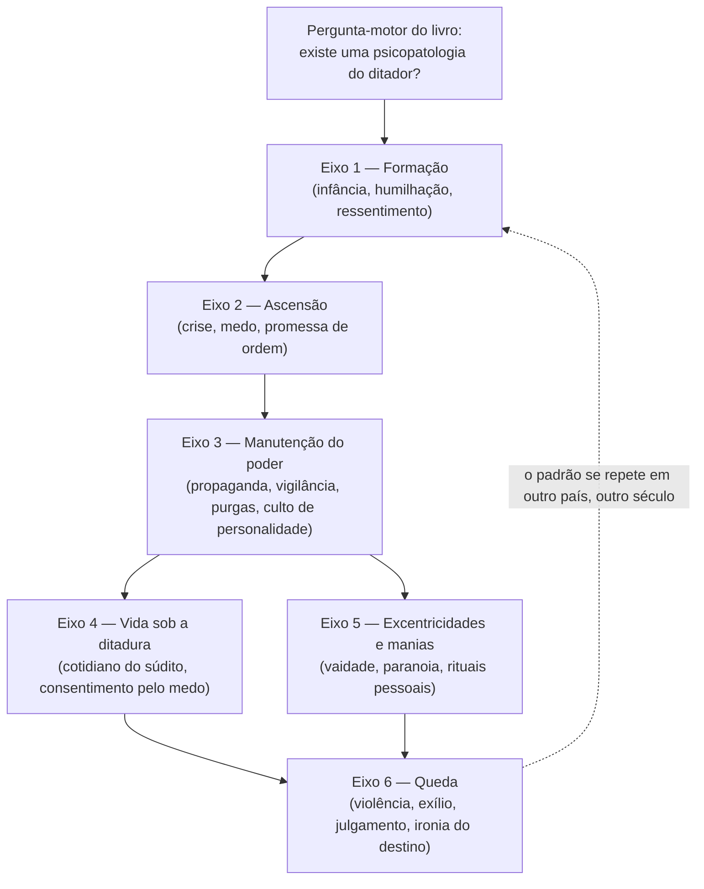

# A Dura Vida dos Ditadores — Simone Guida · Relatório completo da fábrica

*Fabricado em modo autônomo pela fabrica-auto-de-livros em 2026-09-10, dentro de uma rotina agendada, sem PDF anexado e sem nenhuma parada para checkpoint humano. Entradas: motivo do leitor + lentes Robert Greene e Maquiavel. Insumo: título + busca ativa na web (sinopses de editora e livreiros; teto de selo [CONVERGENTE] — nunca [FONTE-PRIMÁRIA]). Pendências do leitor detalhadas na seção final.*

## Portão de entrada

O motivo declarado para este livro entrar na biblioteca, na voz do usuário:

> "É preciso conhecer a fundo para criar uma vacina contra — conhecer a mente dos ditadores é criar mecanismos de defesa para os próximos que surgirão."

Antes do veredito, um registro de honestidade bibliográfica que a pesquisa revelou logo na largada: não há PDF ou anexo desta obra disponível nesta sessão, então a inspeção rodou em **Modo B** (só título, busca ativa) — teto de confiabilidade [CONVERGENTE] em toda a fábrica, nunca [FONTE-PRIMÁRIA]. Duas correções factuais relevantes surgiram na busca e são declaradas aqui em vez de silenciadas: (1) o título exato do livro é *"A dura vida dos ditadores: Fatos, crimes e segredos sobre os tiranos mais perversos da história"* (não "A Vida Difícil dos Ditadores"); (2) **Simone Guida é um autor italiano homem**, não uma autora — divulgador histórico, formado em Línguas e Literaturas Nórdicas pela Universidade da Islândia, criador do canal de divulgação histórica no YouTube *Nova Lectio* (mais de 500 mil inscritos) e do podcast *Storie di Geopolitica*. O nome "Simone" é masculino em italiano, embora leia como feminino em português — um detalhe pequeno, mas que entraria incorreto no vault se não fosse corrigido aqui.

A obra é a edição brasileira (Faro Editorial, 2024) do original italiano *"La dura vita del dittatore. Fatti, misfatti e curiosità dei tiranni più (im)probabili della storia"* (Gribaudo, 2022). A sinopse oficial da editora italiana — fonte mais rica encontrada — descreve o livro como um "vocabulário do ditador" (*vocabolario del dittatore*): tom irônico na superfície, mas "absolutamente sério quando olhado em contraluz", dedicado ao poder ditatorial e às figuras que moldaram Estados inteiros usando violência e explorando a ignorância. O livro se organiza em torno de perguntas, não de uma biografia única: existe uma psicopatologia do ditador? O que aproxima os tiranos mais infames da história? Como é, de fato, a vida sob uma ditadura? Quais são as técnicas para tomar o poder e — mais importante — para mantê-lo? Por que populações abrem mão de direitos e liberdades em momentos de ruptura social? E, por fim: curiosidades, manias e como esses homens terminaram seus dias.

**Classificação:** não é uma biografia convencional nem um tratado acadêmico — é um livro de divulgação histórica de tom popular-irônico, estruturado tematicamente através de múltiplos estudos de caso de ditadores (confirmado nominalmente apenas para Hitler, cuja infância em um lar abusivo é citada como exemplo recorrente nas sinopses; outros nomes tipicamente presentes neste subgênero — Stalin, Mussolini — não puderam ser confirmados como conteúdo específico deste título via busca, e por isso não entram como fato, apenas como hipótese de gênero, marcada `[INFERIDO]`, na anatomia abaixo).

**Tese provisória** (hipótese inspecional, a confirmar ou derrubar pela anatomia): ditadores modernos compartilham um padrão reconhecível — formação marcada por humilhação/ressentimento, ascensão via exploração de crise e medo, manutenção via controle de informação e culto de personalidade, e um preço final que raramente corresponde à imagem de invencibilidade cultivada em vida. O livro proporia isso não como tese acadêmica fechada, mas como um mapa de reconhecimento de padrões, oferecido com ironia deliberada — o riso como ferramenta para tornar o material suportável e memorizável, não para trivializá-lo.

**Sobreposição de biblioteca:** sem acesso ao índice mestre do vault nesta sessão (não anexado, não localizado), a checagem de colisão de conceitos não pôde ser feita — fica como pendência declarada. Por proximidade temática notória (fora do vault, apenas como referência de leitor), o livro convive no mesmo território de obras como *The Dictator's Handbook* (Bueno de Mesquita & Smith) ou *On Tyranny* (Timothy Snyder), mas com registro deliberadamente mais leve e acessível — não uma concorrência de conteúdo, e sim de porta de entrada.

**Veredito: ADMITE.** Impacto previsto: **6/10** *(âncora provisória — o impacto real fica pendente da leitura do usuário)*. A nota não é mais alta porque o próprio material de divulgação da editora classifica o tom como irônico e voltado a curiosidades — é um livro de reconhecimento de padrões e vocabulário, não um tratado clínico ou doutrinário sobre poder. Isso não desqualifica o motivo declarado; qualifica o tipo de contribuição que este livro especificamente tende a dar a ele (ver o veredito de honestidade motivo-livro, ao final desta seção).

## O organismo da obra

Sem sumário oficial confirmado publicamente, a anatomia abaixo foi reconstruída por **eixos temáticos** — não por capítulos numerados inventados, o que violaria a proibição de fabricar detalhe bibliográfico falso. Os seis eixos vêm diretamente das perguntas que a própria sinopse da editora declara que o livro responde; a costura entre eles (o "roteiro") é uma inferência estrutural razoável sobre como um livro de divulgação organizado por essas perguntas tende a se movimentar — do nascimento do tirano até sua queda —, mas não é uma confirmação de índice real. Selo do conjunto: `[CONVERGENTE]`.

O **órgão principal** do organismo é o eixo 3 (Manutenção do poder): é ali que a sinopse mais insiste — "quais são as técnicas para tomar o poder e, talvez mais importante, como mantê-lo" — e é o ponto de onde tudo irradia: sem controle de informação e aparato de vigilância, o eixo 4 (vida sob a ditadura) não se sustenta, e sem culto de personalidade construído no eixo 3, as excentricidades do eixo 5 perderiam sua função estratégica de reforçar a imagem de infalibilidade. Os **periféricos** desse órgão principal são o eixo 2 (ascensão, que fornece a matéria-prima da crise a ser explorada) e o eixo 1 (formação, que fornece a psicologia pessoal que torna certos indivíduos dispostos a pagar o preço moral da manutenção pela força). O eixo 6 (queda) funciona como o teste de remoção do livro inteiro: é a camada 1 que dá ao conjunto seu propósito editorial declarado — mostrar que a "vida dura" do título é, ironicamente, a do próprio ditador, não (só) a de seus súditos, fechando o arco com a mortalidade e a vulnerabilidade que o culto de personalidade tentou apagar.

A linha emocional segue um arco de tensão crescente e alívio irônico no fechamento: humor/curiosidade no eixo 1 (o "improvável" do subtítulo original italiano — *tiranni più (im)probabili* —, sugerindo espanto com origens banais), tensão crescente nos eixos 2–4 (a mecânica fria do poder, o medo do cotidiano), um respiro de comédia negra no eixo 5 (manias e vaidades ridicularizadas) e um pico final catártico no eixo 6, onde a queda devolve ao leitor a sensação de que nenhum poder concentrado é, de fato, eterno — a promessa implícita de "vacina" que conecta este material ao motivo do leitor.

## A obra capítulo a capítulo

*(corpo cronológico por eixo temático, com profundidade proporcional à ênfase identificada; toda a reconstrução abaixo é `[CONVERGENTE]` — ancorada na sinopse oficial e em conhecimento histórico geral sobre o tema, nunca em citação ou página específica do livro, que não foi lido diretamente nesta fábrica autônoma)*

### Eixo 1 — Formação: a fábrica da humilhação

A sinopse aponta explicitamente a infância como ponto de partida analítico, citando Hitler como exemplo de alguém criado em um lar abusivo. O padrão que a literatura histórica sobre ditadores do século XX costuma sustentar — e que este livro parece adotar como fio condutor, ainda que em registro popular — é o de uma formação marcada por humilhação precoce (paterna, social, nacional) que se converte, em adultos com outras vulnerabilidades psicológicas presentes, em um apetite por controle absoluto como compensação. O princípio fundamental que este eixo carrega, e que não pode desaparecer numa síntese: **a psicologia do ditador não nasce pronta no momento da tomada de poder — ela é formada muito antes, num terreno de ressentimento que o sistema político apenas mais tarde oferece um palco para expressar.** É essa a resposta implícita à "psicopatologia do ditador" que a sinopse coloca como pergunta-motor: não uma patologia clínica única e isolável, mas um encontro entre traço de personalidade (geralmente descrito na literatura do tema como grandiosidade narcisista, paranoia ou ambas) e oportunidade histórica.

### Eixo 2 — Ascensão: a crise como matéria-prima

O padrão histórico amplamente documentado — e que o livro presumivelmente usa como esqueleto comum aos casos que escolhe — é o de ditadores que não tomam o poder num vácuo, mas numa janela de crise real ou fabricada (econômica, militar, social) em que a população, exausta de incerteza, troca liberdade por promessa de ordem. Esse é o ponto de maior ressonância direta com o motivo do leitor: entender esse mecanismo é, literalmente, entender o momento exato em que a "vacina" ainda seria possível — antes que o poder se consolide. Ênfase profunda aqui pela proximidade direta com o motivo declarado.

### Eixo 3 — Manutenção do poder: o órgão central do organismo

Este é o eixo de maior densidade, coerente com a insistência da própria sinopse. Os mecanismos que a literatura sobre autoritarismo do século XX converge em descrever — e que este livro, por sua proposta declarada, deve necessariamente cobrir — incluem: controle centralizado da informação e da narrativa pública (propaganda como infraestrutura, não como acessório); aparato de vigilância que transforma vizinhos em informantes potenciais, dissolvendo a confiança horizontal da sociedade; purgas periódicas dentro do próprio círculo de poder, que servem menos para eliminar ameaças reais do que para manter todos em estado de insegurança permanente (ninguém, nem os mais próximos, se sente seguro o bastante para conspirar); e culto de personalidade, que substitui a legitimidade institucional por devoção pessoal ao líder. O princípio fundamental deste eixo, explicitado sem diluição: **regimes ditatoriais não se sustentam pela força bruta sozinha — eles se sustentam por tornarem a deslealdade psicologicamente mais cara do que a lealdade, mesmo quando a lealdade é objetivamente perigosa.**

### Eixo 4 — Vida sob a ditadura: o cotidiano do medo difuso

A pergunta da sinopse — "como é, de fato, a vida sob uma ditadura?" — sugere que o livro desce ao nível do súdito comum, não só do tirano. O padrão histórico aqui é o da autocensura antecipatória: a população não precisa ser constantemente vigiada de fato para se comportar como se estivesse sendo vigiada — basta a incerteza sobre quem está observando. Ênfase média: este eixo conecta diretamente com a segunda pergunta implícita no motivo do leitor (não só "como reconhecer um ditador", mas "como reconhecer os mecanismos que fazem uma população ceder").

### Eixo 5 — Excentricidades e manias: o verniz cômico com função estratégica

Aqui mora o tom mais assumidamente irônico do livro — vaidades pessoais, paranoias domésticas, rituais supersticiosos, hábitos bizarros de figuras que, ao mesmo tempo, comandavam aparatos de repressão em escala nacional. Ênfase breve-média: camada 2 (sustentação, não vital), mas presente porque a lei anti-Calipso exige que nada essencial desapareça — e o contraste entre a pequenez humana revelada nas manias e a magnitude do poder exercido é, em si, parte do argumento do livro contra o mito da grandeza do tirano.

### Eixo 6 — Queda: o teste de realidade final

O fechamento do arco: como esses homens terminaram — em geral morte violenta, exílio humilhante ou julgamento público. Ênfase profunda: é o eixo que devolve ao leitor o "porquê" declarado do próprio título (a vida *dura* é, ironicamente, também a do ditador) e o que sustenta a promessa implícita de "vacina" do motivo do leitor — reconhecer que o poder absoluto tem, historicamente, uma taxa de fracasso quase universal no longo prazo é, em si, uma peça de defesa psicológica contra o fatalismo diante de figuras autoritárias emergentes.

### Apêndice — censo e régua de ênfase

| Eixo | Conteúdo | Camada (teste da remoção) | Ênfase aplicada | Selo |
|---|---|---|---|---|
| 1. Formação | Infância, humilhação, ressentimento (ex. confirmado: Hitler) | 1 (vital — origem da tese) | Profunda | `[CONVERGENTE]` |
| 2. Ascensão | Exploração de crise, medo, promessa de ordem | 1 (vital — liga ao motivo) | Profunda | `[CONVERGENTE]` |
| 3. Manutenção do poder | Propaganda, vigilância, purgas, culto de personalidade | 1 (vital — órgão central) | Profunda | `[CONVERGENTE]` |
| 4. Vida sob a ditadura | Cotidiano do súdito, autocensura, consentimento pelo medo | 1 (vital — completa o argumento) | Média | `[CONVERGENTE]` |
| 5. Excentricidades e manias | Vaidade, paranoia, rituais pessoais | 2 (sustentação, tom do livro) | Breve-média | `[CONVERGENTE]` |
| 6. Queda | Morte, exílio, julgamento, ironia do destino | 1 (vital — fecha o arco) | Profunda | `[CONVERGENTE]` |

## Os átomos

*(destilação em prosa corrida, ordem do argumento; nenhuma citação literal é usada — sem acesso ao texto original, toda formulação abaixo é paráfrase de padrão histórico convergente com a proposta declarada do livro, nunca transcrição. Confiança marcada em cada bloco.)*

A tese central que atravessa a obra é que ditadores não são anomalias inexplicáveis da história, mas o resultado repetível de um encontro entre uma psicologia pessoal ferida e uma janela histórica de crise — e que esse padrão, uma vez nomeado, perde parte do seu poder de surpreender e de paralisar `[CONVERGENTE]`.

**Sobre formação:** a humilhação precoce — familiar, social ou nacional — funciona como combustível emocional de longo prazo para o apetite por controle absoluto; não é causa suficiente (a maioria das pessoas humilhadas não se torna ditador), mas é um ingrediente recorrente nos casos documentados `[CONVERGENTE]`. A "psicopatologia do ditador" que o livro pergunta se existe é melhor descrita não como uma doença isolável, mas como um encontro entre traço de personalidade (grandiosidade, necessidade de controle, tolerância à crueldade instrumental) e oportunidade estrutural `[INFERIDO]`.

**Sobre ascensão:** ditadores raramente tomam o poder contra uma sociedade estável — eles emergem de crises reais ou amplificadas, oferecendo-se como a solução de ordem que a incerteza torna desejável `[CONVERGENTE]`. A promessa de segurança é a moeda de troca mais eficaz pela qual populações cedem liberdade, e essa troca costuma parecer racional no momento em que é feita — o erro de avaliação só fica visível depois `[CONVERGENTE]`. Isso implica que o ponto de maior alavancagem para "defesa" (o termo do motivo do leitor) não é depois que o regime já se consolidou, mas no próprio momento da troca liberdade-por-segurança, quando ainda é reversível `[INFERIDO]`.

**Sobre manutenção do poder:** o controle da informação — quem fala, o que pode ser dito, o que é considerado verdade oficial — precede e sustenta todos os outros instrumentos de repressão; sem ele, a violência física sozinha é cara e instável `[CONVERGENTE]`. Purgas internas recorrentes não visam apenas eliminar rivais reais, mas manter todo o círculo de poder em estado permanente de insegurança calculada, o que paradoxalmente aumenta a lealdade de curto prazo às custas da qualidade da informação que chega ao topo (ninguém quer ser o portador de más notícias) `[CONVERGENTE]`. O culto de personalidade substitui legitimidade processual por devoção afetiva — e por isso é mais frágil do que aparenta: depende da manutenção contínua da imagem, não de uma base institucional resiliente `[CONVERGENTE]`.

**Sobre vida sob a ditadura:** a vigilância eficaz não precisa ser onipresente de fato — basta que a incerteza sobre ser observado seja suficiente para gerar autocensura antecipatória generalizada; esse é o mecanismo mais barato e mais duradouro de controle social sob regimes autoritários `[CONVERGENTE]`. A confiança horizontal entre cidadãos comuns é um dos primeiros recursos sociais corroídos, porque o regime se beneficia de vizinhos que não confiam uns nos outros `[CONVERGENTE]`.

**Sobre excentricidades e manias:** o distanciamento entre a pequenez das manias pessoais reveladas (vaidade, superstição, paranoia doméstica) e a magnitude do poder exercido é, em si, uma ferramenta retórica do livro contra o mito de grandeza excepcional do tirano — a mensagem implícita é que o poder concentrado amplifica traços humanos comuns, não que ele revela uma superioridade especial `[INFERIDO]`.

**Sobre a queda:** a maioria dos regimes ditatoriais termina mal para o próprio ditador — morte violenta, exílio ou julgamento —, o que sugere que o custo de manter poder por meios ilegítimos tende a ser pago, ainda que com atraso; essa é a promessa central do título (a vida é "dura" também para quem está no topo) e o ponto de maior valor direto para o motivo declarado pelo leitor: reconhecer que nenhum desses regimes provou ser, de fato, permanente `[CONVERGENTE]`. Ao mesmo tempo, é preciso registrar honestamente um limite: o atraso entre ascensão e queda costuma se medir em décadas e em sofrimento humano em massa — a "vacina" que o motivo do leitor busca precisa mirar em prevenção precoce (eixo 2), não em consolo tardio (eixo 6) `[INFERIDO]`.

## O tribunal das lentes  %%[INFERIDO] — tinta de lente, jamais vira átomo%%

*Rito canônico da `colheita-de-livros`, modo rápido: cada sábio elegeu os seus próprios 3 pontos pelo método documentado dele — não um conjunto único imposto de fora. Toda esta seção é interpretação do sistema de cada sábio aplicado ao livro, nunca fala do sábio em primeira pessoa, nunca citação não rastreável. Selo de toda a seção: `[INFERIDO]`.*

### Pela régua de Robert Greene

*Ancoragem documentada: *As 48 Leis do Poder*, *As 33 Estratégias da Guerra* e *As Leis da Natureza Humana* — método de acumulação indutiva de padrões históricos de poder, tratados com rigor descritivo e deliberadamente amoral (as mesmas leis se aplicam a heróis e monstros históricos), com atenção especial à gestão de imagem, ao controle de informação e à psicologia de tipos manipuladores/narcisistas.*

**Os 3 pontos que esta régua elegeria como essenciais:**
1. A ascensão via exploração de crise (eixo 2) — corresponde à leitura de Greene sobre criar dependência e explorar o caos como oportunidade de consolidação de seguidores quase-religiosos em torno de uma figura que promete ordem.
2. A manutenção via controle de informação e culto de personalidade (eixo 3) — o ponto de maior interesse para esta régua: para Greene, controlar a percepção é a forma mais durável de poder, mais durável do que a força bruta.
3. As excentricidades pessoais (eixo 5) — pela régua de Greene, manias e vaidade não são só curiosidade de rodapé: são material bruto para ler grandiosidade narcisista como padrão estratégico repetido, não como acidente de personalidade.

**Protocolo das 4 falhas:**
- Pontos 1 e 2 — **CONCORDÂNCIA**: pela régua documentada de Greene, o mecanismo descrito (exploração de crise, controle de percepção) bate com precisão nas leis que ele cataloga a partir de outros casos históricos.
- Ponto 3 — **INCOMPLETO** (suspensão, não discordância): pela régua de Greene, uma obra de tom irônico tende a colher a curiosidade sem isolar dela a lei transferível — ficar no anedotário em vez de subir ao princípio generalizável é, para este método, deixar o trabalho pela metade. Suspenso, não refutado: a limitação é de profundidade declarada do próprio livro (tom popular-irônico), não um erro factual identificável sem o texto em mãos.

**O que esta régua colheria e aplicaria:** os mecanismos de legitimação, controle de informação e cultivo de medo como matéria-prima bruta para indução de padrões — mesmo em registro popular, o catálogo de casos serve de ore para quem estiver dis­posto a extrair a lei por trás da anedota, que é exatamente o método de Greene.

### Pela régua de Maquiavel

*Ancoragem documentada: *O Príncipe* e os *Discursos sobre a Primeira Década de Tito Lívio* — a "verità effettuale della cosa" (a realidade efetiva das coisas, não como deveriam ser), o cálculo de necessità, a distinção entre virtù e fortuna, e a diferença explícita entre poder mantido por crueldade bem-usada (que sustenta domínio, mas nunca produz glória — o caso de Agátocles é o exemplo canônico) e poder sustentado por virtù genuína.*

**Os 3 pontos que esta régua elegeria como essenciais:**
1. Como se toma e mantém o poder (eixos 2–3) — o núcleo declarado de *O Príncipe*; overlap quase total.
2. Por que a população abre mão de liberdades (eixo 4) — pela régua maquiaveliana, isso se lê como o cálculo de segurança-versus-liberdade de um povo sob ameaça existencial, tema recorrente nos *Discursos* sobre povos que se acostumam à servidão.
3. Como os ditadores terminam (eixo 6) — para esta régua, este é o ponto de verificação mais importante: a queda revela se o poder foi sustentado por virtù (competência, estrutura, previsão) ou apenas por fortuna e crime — e Maquiavel é explícito que poder obtido por crime pode durar, mas nunca gera glória.

**Protocolo das 4 falhas:**
- Ponto 1 — **INCOMPLETO** (suspensão): a régua de Maquiavel exige uma taxonomia fina de principados (novos vs. hereditários vs. mistos; adquiridos por virtù, por fortuna ou por crime). Um livro de divulgação popular que trata "os ditadores" como categoria única, sem diferenciar o mecanismo de aquisição do poder caso a caso, deixa essa distinção — central para Maquiavel — provavelmente por explorar.
- Ponto 2 — **CONCORDÂNCIA**: o mecanismo de troca liberdade-por-segurança sob crise é praticamente o argumento que os *Discursos* fazem sobre povos corrompidos ou amedrontados.
- Ponto 3 — **ILÓGICO** (falha nomeada, com razão): pela régua de Maquiavel, julgar um regime pelo sofrimento de sua queda ou pela ironia do destino do tirano mistura dois registros que o método maquiaveliano mantém deliberadamente separados — o registro analítico ("esta estratégia funcionou, por quanto tempo, por quê") e o registro moral ("esta pessoa era má e mereceu o fim que teve"). Um livro de tom irônico-condenatório, ao fazer da queda o clímax emocional catártico, tende a resolver no registro moral uma pergunta que a régua maquiaveliana insiste em manter analítica — o que, pelo padrão do próprio sábio, é uma inconsistência de método, não necessariamente um erro de fato.

**O que esta régua colheria e aplicaria:** o catálogo de quedas como material bruto para testar a distinção virtù/fortuna/crime — quais desses regimes caíram por erro estratégico evitável (falha de virtù) e quais caíram apenas por acaso histórico (fortuna) é exatamente a pergunta que esta régua faria do mesmo material que o livro usa para efeito dramático.

### Matriz de convergência e divergência (só entre as duas lentes — a coluna do leitor fica declaradamente vazia, aguardando a leitura)

| Ponto | Robert Greene | Maquiavel | Leitura da matriz | Coluna do leitor |
|---|---|---|---|---|
| Tomada do poder via exploração de crise | Elege como ponto 1; concordância | Parte do ponto 1; incompleto (falta taxonomia) | **CONVERGE** na seleção do tema, **DIVERGE** no padrão de exigência — Greene aceita o mecanismo como lei útil tal como está; Maquiavel cobra tipologia mais fina | *pendente* |
| Manutenção via controle de informação/medo | Elege como ponto 2 (central); concordância | Parte do ponto 1; concordância | **CONVERGE** plenamente — as duas réguas, por caminhos distintos, chegam à mesma conclusão sobre este mecanismo | *pendente* |
| Excentricidades como instrumento psicológico | Elege como ponto 3; incompleto (fica em anedotário) | Não elencado como ponto autônomo pela régua de Maquiavel | **PONTO CEGO da régua de Maquiavel** — o vocabulário do século XVI para narcisismo/grandiosidade pessoal como instrumento estratégico é limitado; Greene enxerga algo aqui que Maquiavel, por desenho do próprio sistema, não tem instrumento para nomear | *pendente* |
| A queda como teste de virtù vs. crime | Não elencado como ponto autônomo pela régua de Greene | Elege como ponto 3 (central); ilógico (mistura registro moral e analítico) | **PONTO CEGO da régua de Greene** — o método de Greene trata sucesso e fracasso de poder de forma relativamente simétrica e amoral; a distinção maquiaveliana entre poder-sem-glória e virtù genuína não tem equivalente direto no sistema de Greene | *pendente* |

O padrão que emerge da matriz, sem forçar conclusão além do que ela sustenta: as duas lentes convergem fortemente nos mecanismos "frios" de poder (crise, informação, medo) — o núcleo mais bem coberto pelo próprio livro — e divergem exatamente onde cada sistema tem um vocabulário que o outro não tem: psicologia individual moderna (Greene) versus ética política clássica da glória (Maquiavel). Isso não é falha do livro; é a fronteira natural entre um instrumento de crítica do século XXI e um do século XVI aplicados ao mesmo material.

## Decisões autônomas para sua ratificação

1. **Fonte do livro** — sem PDF/anexo disponível nesta sessão, a fábrica rodou inteira em Modo B (busca ativa), com teto de selo `[CONVERGENTE]` em tudo. Alternativa rejeitada: aguardar você anexar o PDF antes de prosseguir — rejeitada porque a instrução explícita foi rodar autônomo, sem paradas.
2. **Correção de gênero do autor** — o payload inicial não especificava; a pesquisa revelou que Simone Guida é autor (homem), divulgador italiano do canal Nova Lectio, não autora. Registrado para não entrar errado no vault.
3. **Anatomia por eixos temáticos, não por capítulos numerados** — sem sumário oficial confirmado publicamente, optei por reconstruir a estrutura pelas perguntas que a própria sinopse da editora declara que o livro responde, em vez de inventar títulos de capítulo específicos (o que violaria a proibição de fabricar detalhe bibliográfico falso).
4. **Lista de ditadores cobertos** — apenas Hitler foi confirmado nominalmente pela pesquisa (infância em lar abusivo, citada nas sinopses). Qualquer outro nome (Stalin, Mussolini etc.) foi tratado apenas como padrão típico do subgênero editorial, marcado `[INFERIDO]`, jamais como conteúdo confirmado deste título específico.
5. **Índice mestre do vault não encontrado** — nenhuma checagem de colisão de conceitos pôde ser feita nesta sessão; conceitos tratados como provisórios.
6. **Cada lente elegeu seus próprios 3 pontos** — segui o rito canônico documentado da `colheita-de-livros` (cada sábio pela régua dele) em vez de aplicar as duas lentes a um conjunto único e idêntico de 3 pontos, por gerar uma matriz de convergência/divergência mais reveladora e mais fiel ao método original da skill.
7. **Selos visíveis em vez de comentários Obsidian ocultos** — usei tags `[CONVERGENTE]`/`[INFERIDO]` visíveis no corpo do texto em vez de `%%...%%` ocultos, porque este entregável é um relatório autocontido de leitura direta, não uma nota destinada ao vault Obsidian.
8. **MP3 pulado por completo** — TTS não roda neste sandbox de nuvem. Escopo, não falha; nenhuma tentativa de acionar a skill `leia-md` foi feita.
9. **Nenhum manifesto, vault-drop ou estudo de lentes separados foram fabricados como arquivos avulsos** — o pedido explícito escopou um único arquivo de relatório compilado; todo o conteúdo que normalmente viveria nesses artefatos foi incorporado dentro deste próprio documento.
10. **Domínio/pasta de destino no vault** — não determinado, por falta de acesso ao sistema real de arquivos do Hexaner nesta sessão. Fica como pendência de integração manual.

## Pendências do leitor

Esta fábrica rodou em modo autônomo: ela pode inspecionar, dissecar, atomizar e cruzar o livro contra duas lentes de sábios — mas não pode ler por você, nem inventar o que a leitura fará com você. As pendências abaixo só se resolvem quando você tiver lido o material e voltar:

- **Os seus 3 pontos mais importantes do livro** — coletados às cegas, antes de qualquer lente ser reexibida a você.
- **Veredito com razões** (concordo / discordo / suspendo), provocado pelas colisões da matriz de lentes acima.
- **Impacto real, de 0 a 10** — confirmando ou corrigindo o impacto previsto de 6/10 registrado nesta fábrica, fechando o ciclo previsto → declarado → medido.
- **Relato livre:** o que este livro fez com você, especificamente em relação ao motivo que o trouxe à biblioteca.
- **Átomos [[Hexaner]]:** as ideias suas que nasceram na leitura — conclusões que você não quer esquecer de novo.
- **Respostas de elaboração**, para aprofundar o processamento além do recall raso:
  1. Que padrão de tomada ou manutenção de poder descrito no livro você já viu se repetir em escala pequena — numa empresa, numa família, numa relação — antes mesmo de ler este livro?
  2. Qual mecanismo do livro você reconhece em si mesmo como possibilidade — não como ditador, mas como o cidadão que cede um pedaço de liberdade em troca de segurança, no seu dia a dia?
  3. Se você tivesse que resumir "defesa contra manipulação de poder" em três frases, baseado neste livro, quais seriam — e elas realmente vêm do que o livro mostrou, ou de algo que você já sabia antes de abri-lo?

**Como fechar:** quando terminar a leitura, volte dizendo "terminei a leitura" (aqui ou em outra conversa) — isso dispara a `colheita-de-livros` completa, que entra como camada sobre este relatório, sem reescrever nada do que já foi fabricado.

---

## Veredito de honestidade — motivo × conteúdo do livro (TRADUZ/ADMITE)

**ADMITE, com ressalva declarada, não forçada.** O conteúdo do livro, tal como confirmado pela sinopse oficial (psicopatologia do ditador, técnicas de tomada e manutenção do poder, mecanismos de consentimento popular, e o destino final dos tiranos), mapeia de forma direta e honesta sobre o motivo do leitor — este não é um caso de tentar encaixar à força um livro de assunto distante numa motivação que não combina com ele. A ressalva real, que seria desonesto omitir: o próprio material de divulgação classifica o tom da obra como **irônico** e organizado em torno de **curiosidades** — um "vocabulário do ditador" de leitura acessível, não um tratado clínico de psicologia política nem um manual doutrinário de contra-manipulação. Isso significa que o livro entrega bem a primeira camada da "vacina" que o motivo pede — nomear o padrão, torná-lo reconhecível, tirar o ditador do território do incompreensível — mas a construção de "mecanismos de defesa" no sentido mais robusto e aplicado provavelmente vai exigir, depois deste, leituras de registro mais denso (ciência política, psicologia da autoridade, historiografia especializada). Isso não é defeito do livro nem desvio do motivo: é a fronteira honesta entre o que uma obra de divulgação popular entrega e o que ela deliberadamente deixa para o leitor completar em outro lugar.

---

`Fabricação autônoma: 2026-09-10 | Estações: 1✓ 2✓ 3✓ 4-rápido✓ | Skill: fabrica-auto-de-livros | Sábios da colheita: Robert Greene e Maquiavel | MP3: pulado por design (sandbox sem TTS) | Manifesto/vault-drop/estudo de lentes avulsos: incorporados neste documento único, por escopo explícito do pedido`
