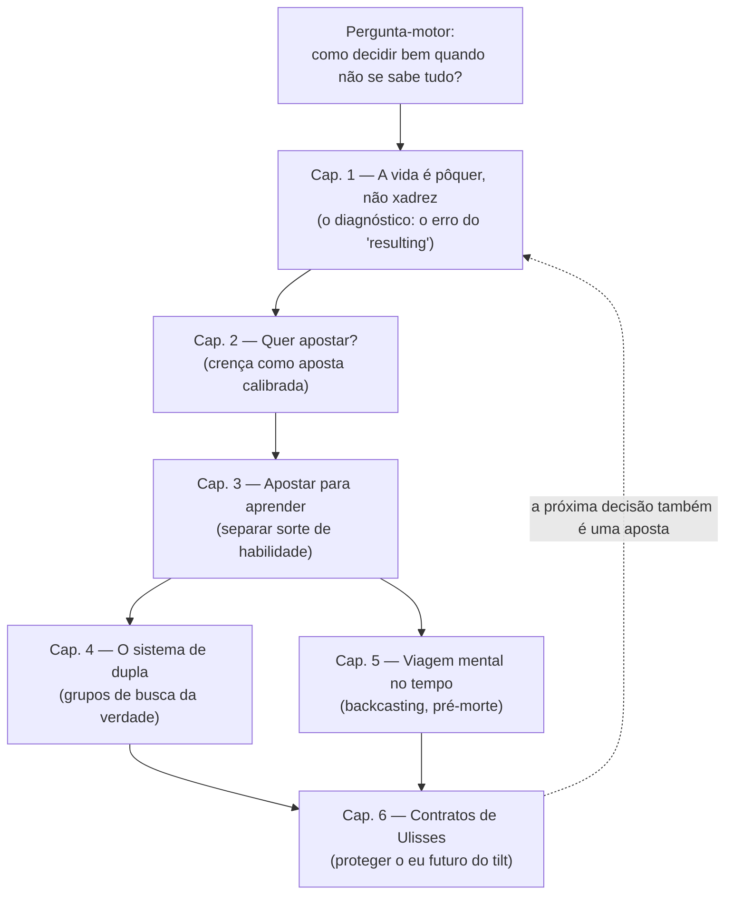

# Pensar em Apostas — Annie Duke · Relatório completo da fábrica

*Fabricado em modo autônomo pela fabrica-auto-de-livros em 2026-09-10, dentro de uma rotina agendada, sem PDF anexado e sem nenhuma parada para checkpoint humano. Entradas: motivo do leitor + lentes Robert Greene e (com ressalva de identificação declarada abaixo) Lawrence Freedman. Insumo: título + base de conhecimento + busca ativa confirmatória na web; teto de selo `[CONVERGENTE]` — nunca `[FONTE-PRIMÁRIA]`, pois o texto integral não foi lido diretamente nesta fábrica. Pendências do leitor detalhadas na seção final.*

## Portão de entrada

O motivo declarado para este livro entrar na biblioteca, na voz do usuário:

> "Para aprender a tomar decisões quando não se tem todas as informações, mas é preciso agir para não perder a janela de oportunidade."

Antes do veredito, dois registros de honestidade que a fábrica precisa fazer às claras.

**Primeiro, sobre a obra em si.** *Thinking in Bets: Making Smarter Decisions When You Don't Have All the Facts* (Annie Duke, 2018) é amplamente resenhado, com estrutura pública bem documentada — a busca confirmatória validou sumário, editora brasileira e tradução. A edição brasileira, *"Pensar em apostas: decidindo com inteligência quando não se tem todos os fatos"*, é publicada pela Alta Books (tradução de Carlos Bacci Junior), com prefácio de Steven D. Levitt (*Freakonomics*). Vale registrar, sem forçar: **o subtítulo oficial — "decidindo com inteligência quando não se tem todos os fatos" — é quase uma paráfrase literal do motivo que o usuário escreveu com as próprias palavras**, antes de qualquer contato desta fábrica com o material da editora. Annie Duke é ex-jogadora profissional de pôquer (bracelete da World Series of Poker, campeã do Tournament of Champions de 2004), com pós-graduação em psicologia cognitiva na Universidade da Pensilvânia — combinação de prática competitiva sob incerteza e ciência comportamental que estrutura o método do livro `[CONVERGENTE]`.

**Segundo, sobre a Lente 2.** O payload não trouxe nome de sábio, mas a descrição "autor do livro 'a história da estratégia'". A busca aponta um candidato dominante e essencialmente único: **Sir Lawrence Freedman**, historiador britânico de estudos estratégicos, autor de *Strategy: A History* (Oxford University Press, 2013, eleito um dos melhores livros do ano pelo *Financial Times*), publicado em português como *"Estratégia"* (há edições portuguesas próximas, como "Estratégia: Uma História", e a tradução espanhola quase idêntica *"Estrategia: Una historia"*). Não foi possível confirmar, nesta busca, uma edição cujo título reproduza literalmente a string "A História da Estratégia" palavra por palavra — o mais próximo confirmado é "Estratégia". **Nível de confiança: alto, não absoluto** — não há candidato concorrente plausível para essa descrição quase definicional. A fábrica optou por **prosseguir com Freedman como Lente 2**, em vez de recusar a lente — mas a seção que a aplica carrega, além do selo padrão `[INFERIDO]` de toda leitura de sábio, esta camada extra de incerteza de identificação, declarada aqui e não escondida atrás de uma atribuição como se o usuário tivesse nomeado a pessoa diretamente.

**Classificação:** não-ficção de ciência da decisão em registro de divulgação séria — mais próxima de Daniel Kahneman e Philip Tetlock do que de autoajuda; argumentativa, construída sobre estudos de caso (pôquer profissional, esportes, política, negócios) e pesquisa em psicologia cognitiva e comportamental.

**Estrutura aparente:** introdução + seis capítulos, sumário confirmado por busca em múltiplas fontes (resumos comerciais, amostra oficial da editora): "Por que isto não é um livro sobre pôquer" / "A vida é pôquer, não xadrez", "Quer apostar?", um capítulo sobre separar sorte de habilidade e "apostar para aprender", "O sistema de dupla" (grupos de verificação de verdade), "Aventuras na viagem mental no tempo" (simulação de cenários futuros) e um capítulo de fechamento sobre autocontrole e contratos de pré-compromisso. Teto de confiabilidade desta reconstrução: `[CONVERGENTE]` — múltiplas fontes secundárias convergem no mesmo sumário, mas o texto primário não foi lido linha a linha nesta fábrica.

**Vocabulário suspeito** (checado contra índice mestre: não localizado nesta sessão — todos os termos entram como `[INÉDITO]`, pendente de checagem de colisão real): *resulting* (avaliar decisão pelo resultado), *tilt* (estado emocional que degrada julgamento, termo do pôquer), *contrato de Ulisses* (pré-compromisso contra o eu futuro impulsivo), *decision pod* / grupo de busca da verdade, *backcasting* e *pré-morte* (premortem, termo de Gary Klein), *calibração* de crença.

**Tese provisória** (hipótese inspecional, confirmada pela anatomia abaixo): decisões deveriam ser tratadas como apostas contra um futuro incerto — o conhecimento presente nunca é completo, então a pergunta certa nunca é "isso vai dar certo?" mas "dado o que sei agora, qual é a melhor aposta, e quanto eu apostaria nela?". A qualidade da decisão e a qualidade do resultado são coisas diferentes que o cérebro insiste em confundir (o erro que o livro batiza de "resulting"); corrigir essa confusão exige pensamento probabilístico, grupos externos de checagem, simulação mental do futuro antes de agir e mecanismos de proteção contra o próprio estado emocional.

**Sobreposição de biblioteca:** sem acesso ao índice mestre do vault nesta sessão, a checagem formal de colisão fica pendente. Por proximidade temática notória (fora do vault, como referência de leitor): *Thinking, Fast and Slow* (Kahneman), *Superforecasting* (Tetlock & Gardner) e *Noise* (Kahneman, Sibony & Sunstein) ocupam território adjacente — mas *Pensar em Apostas* se diferencia por ancorar tudo em decisões de ação sob prazo (apostar é decidir e agir, não só prever), o que é exatamente o encaixe com o motivo do usuário.

**Veredito: ADMITE.** Impacto previsto: **9/10** *(âncora provisória — o impacto real fica pendente da leitura do usuário)*. A nota é alta porque o encaixe entre motivo e conteúdo é praticamente definicional, não apenas temático — ver o veredito de honestidade completo ao final deste relatório. Não é 10 porque impacto real depende de aplicação, não só de encaixe conceitual: um livro pode nomear o problema com precisão e ainda assim não mudar comportamento sem prática deliberada — e isso só a leitura e o tempo dirão.

## O organismo da obra

O **órgão principal** é o diagnóstico do capítulo 1 — o "resulting", a confusão entre qualidade da decisão e qualidade do resultado. É dali que tudo irradia: sem esse diagnóstico nomeado, nenhuma ferramenta seguinte (apostas calibradas, grupos de verificação, simulação mental, contratos de pré-compromisso) teria propósito. Os **periféricos diretos** são o viés de retrospecto e o viés self-serving (creditar a si mesmo as vitórias, culpar o azar nas derrotas) — mecanismos que fazem o "resulting" parecer racional por dentro.

O segundo sistema — pensamento probabilístico e crença como aposta (caps. 2-3) — é o **método**: medir a própria convicção em percentuais em vez de certezas binárias, e usar o teste "quer apostar?" como honestidade epistêmica. O terceiro é **social**: grupos de busca da verdade (cap. 4), inspirados em comunidades de pôquer que revisam mãos jogadas em conjunto, corretivo externo para pontos cegos — desde que recompensem precisão, não concordância. O quarto é **temporal**: simular o futuro antes de agir — backcasting, "pré-morte" — move o arrependimento para antes da decisão, quando ainda é útil. O sistema final, que fecha o arco, é de **autocontrole**: contratos de Ulisses e o reconhecimento do "tilt" — o estado emocional que faz até quem sabe a teoria decidir mal na hora H, quando a janela de oportunidade está mais estreita.

A linha emocional segue um arco de confronto e reparação: abre com indignação pública e reconhecimento incômodo (o caso Pete Carroll, decisão chamada de "a pior da história" após dar errado, mesmo defensável); os caps. 2-3 são introspectivos e desconfortáveis (confrontar a própria teimosia de crenças); o cap. 4 respira — o momento mais social e esperançoso; o cap. 5 tem tom quase confessional, sobre mortalidade suave; o fechamento no cap. 6 é prático e fortalecedor — contratos de Ulisses como ato de compaixão consigo mesmo, o "eu de hoje, calmo" amarrando o "eu de amanhã, sob pressão".

## A obra capítulo a capítulo

*(corpo cronológico, profundidade proporcional à ênfase identificada; conteúdo reconstruído por conhecimento de base sobre uma obra amplamente documentada, cruzado com busca confirmatória de sumário oficial e material de divulgação da editora brasileira — nenhuma citação literal de página é usada, por não haver leitura direta do texto nesta fábrica autônoma. Selo do conjunto: `[CONVERGENTE]`.)*

### Introdução e Capítulo 1 — A vida é pôquer, não xadrez

O livro abre negando o próprio gênero que o leitor esperaria — a introdução, "por que isto não é um livro sobre pôquer", usa os dezoito anos de Duke como jogadora profissional não como assunto, mas como laboratório de observação sobre decisão sob incerteza. O capítulo 1 apresenta o caso-âncora do livro: a decisão do técnico Pete Carroll de mandar um passe, em vez de uma corrida com Marshawn Lynch, na última jogada da final do Super Bowl XLIX — o passe foi interceptado, o time perdeu, e a imprensa chamou a decisão de "a pior jogada da história do Super Bowl" na manhã seguinte `[CONVERGENTE]`. Duke usa o caso para nomear o mecanismo central do livro: **"resulting"** — julgar a qualidade de uma decisão pela qualidade do resultado que ela produziu, quando as duas só coincidem na ausência de incerteza e acaso `[CONVERGENTE]`. Princípio fundamental, que não pode desaparecer em nenhuma síntese: **uma decisão excelente pode dar errado por má sorte, e uma decisão péssima pode dar certo por boa sorte — julgar só pelo resultado ensina a lição errada e reforça, com o tempo, os piores hábitos de julgamento.** O xadrez (informação perfeita, sem acaso) é o mau modelo mental para a vida real; o pôquer (informação oculta, sorte genuína, onde o melhor jogador do mundo perde mãos boas com frequência) é o modelo correto `[CONVERGENTE]`. O capítulo fecha redefinindo "estar errado": não é acertar ou errar o resultado, é calibrar corretamente a confiança dado o que se sabia no momento.

### Capítulo 2 — Quer apostar?

Se o capítulo 1 é o diagnóstico, este é a virada de método: **toda decisão é, estruturalmente, uma aposta contra o futuro** — inclusive as sem dinheiro envolvido, porque tempo, atenção e reputação também são apostados `[CONVERGENTE]`. O capítulo mostra, com apoio em pesquisa comportamental sobre formação de crença, que aceitamos informação como verdadeira por padrão e só depois, com esforço extra, verificamos — a maioria das apostas mentais são, na origem, apostas contra nós mesmos `[CONVERGENTE]`. Daí nasce a "teimosia das crenças": uma vez formada, ela resiste a evidência contrária, e — ponto mais desconfortável do capítulo — pessoas mais inteligentes tendem a ser *melhores* em racionalizar crenças erradas, não piores, por terem mais recursos cognitivos para a defesa `[CONVERGENTE, generalização moderada — pesquisa citada no livro, não verificada linha a linha nesta fábrica]`. A ferramenta que fecha o capítulo, uma das mais citadas do livro: perguntar-se "quer apostar?" diante de uma afirmação própria, forçando a certeza vaga a virar número — o teste que revela se a convicção é real ou só hábito de fala `[CONVERGENTE]`.

### Capítulo 3 — Apostar para aprender

Aprofunda a separação entre sorte e habilidade como disciplina contínua, não veredito único aplicado depois do fato. Duke usa a metáfora do jogador de beisebol indo buscar a bola em campo ("fielding"): não dá para mudar a decisão já tomada, só reagir bem ao que aconteceu e aprender sem se punir nem se gabar em excesso `[CONVERGENTE]`. O capítulo detalha como pensar em faixas de resultados possíveis, ponderadas por probabilidade, em vez de um único desfecho certo ou errado `[CONVERGENTE]`. Ênfase média: capítulo-ponte entre o diagnóstico e as ferramentas sociais e temporais seguintes.

### Capítulo 4 — O sistema de dupla

O livro sai da mente individual e entra no grupo. As comunidades informais de jogadores de pôquer que compartilham mãos jogadas e se dão feedback honesto viram o modelo do **grupo de busca da verdade** ("truthseeking group"/"decision pod") — um círculo comprometido a apontar erros de raciocínio uns dos outros, mesmo quando incômodo `[CONVERGENTE]`. Princípio central: **um grupo só corrige viés individual se recompensar precisão, não concordância** — a diferença entre grupo de busca da verdade e câmara de eco está no que ele pune e no que ele aplaude, não em quanto as pessoas se gostam `[CONVERGENTE]`. Ênfase profunda: um dos capítulos mais citados em resenhas, por oferecer ferramenta prática e replicável, não só conceito.

### Capítulo 5 — Aventuras na viagem mental no tempo

Duke apresenta o **backcasting** (projetar-se no futuro e trabalhar de trás para frente) e a **pré-morte** (premortem, termo de Gary Klein) — imaginar vividamente que a decisão já fracassou e perguntar por quê, *antes* de agir, expondo riscos que o otimismo do planejamento normalmente esconde `[CONVERGENTE]`. A formulação mais memorável: **"mover o arrependimento para antes da decisão"** — simulá-lo como ferramenta preventiva, não como punição posterior inútil `[CONVERGENTE]`. Ênfase média-alta: elo entre o pensamento probabilístico (caps. 2-3) e o autocontrole final (cap. 6).

### Capítulo 6 — Contratos de Ulisses

O fechamento do arco. **Contrato de Ulisses** — mecanismos de pré-compromisso que amarram o "eu futuro" contra um impulso previsível, em referência ao herói que se amarra ao mastro para resistir ao canto das sereias, sabendo de antemão que sua vontade no momento será fraca demais `[CONVERGENTE]`. Recupera o termo **"tilt"**, do pôquer — o estado emocional que degrada a decisão mesmo em quem domina toda a teoria — e argumenta que reconhecer os próprios gatilhos de tilt com antecedência é parte da disciplina de decidir bem, não um tema à parte `[CONVERGENTE]`. Ênfase profunda: devolve a peça que faltava — de nada adianta calibrar probabilidades e montar grupos de verificação se, na hora de decidir sob pressão real (a "janela de oportunidade" do motivo do leitor), o estado emocional sequestra o julgamento. É o teste de remoção do livro inteiro: sem este capítulo, as ferramentas anteriores permaneceriam teóricas.

### Apêndice — censo e régua de ênfase

| Unidade | Conteúdo | Camada (teste da remoção) | Ênfase aplicada | Selo |
|---|---|---|---|---|
| Intro + Cap. 1 | Diagnóstico do "resulting"; pôquer vs. xadrez; caso Pete Carroll | 1 (vital — origem de toda a tese) | Profunda | `[CONVERGENTE]` |
| Cap. 2 | Crença como aposta; teste "quer apostar?"; teimosia de crenças | 1 (vital — o método nasce aqui) | Profunda | `[CONVERGENTE]` |
| Cap. 3 | Separar sorte de habilidade; "apostar para aprender"; faixas de probabilidade | 2 (sustentação — aprofunda o método sem introduzir princípio novo) | Média | `[CONVERGENTE]` |
| Cap. 4 | Grupos de busca da verdade; sistema de dupla; recompensar precisão, não concordância | 1 (vital — o corretivo social) | Profunda | `[CONVERGENTE]` |
| Cap. 5 | Backcasting; pré-morte; mover o arrependimento para antes da decisão | 2 (sustentação — ferramenta derivada do método central) | Média | `[CONVERGENTE]` |
| Cap. 6 | Contratos de Ulisses; tilt; autocontrole sob pressão | 1 (vital — fecha o arco e resolve a lacuna teoria-prática) | Profunda | `[CONVERGENTE]` |

## Os átomos

*(destilação em prosa corrida, na ordem do argumento; paráfrase fiel de um livro amplamente documentado, sem citação literal por não haver leitura direta do texto original nesta fábrica autônoma.)*

A tese central que atravessa a obra é que decidir bem não é sobre acertar o resultado — é sobre calibrar corretamente a confiança dada a informação disponível no momento da decisão, tratando cada escolha como uma aposta cujo valor se avalia pelo raciocínio que a produziu, não pela sorte que a seguiu `[CONVERGENTE]`.

**Sobre o diagnóstico central:** o "resulting" — avaliar decisões pelos resultados obtidos, não pela qualidade do processo no momento em que foram tomadas — é o erro que o livro existe para corrigir; é reforçado por dois mecanismos que se alimentam: viés de retrospecto (parecer óbvio, depois do fato, o que não era óbvio antes) e viés self-serving (creditar habilidade nas vitórias, culpar o azar nas derrotas) `[CONVERGENTE]`. Quem julga decisões passadas só pelo resultado aprende as lições erradas e repete os mesmos erros de processo, só que com mais confiança `[INFERIDO — extrapolação da implicação comportamental do argumento]`.

**Sobre pensamento probabilístico:** toda decisão é uma aposta contra um futuro incerto — inclusive sem dinheiro envolvido, pois tempo, atenção e reputação também são apostados `[CONVERGENTE]`. Crenças deveriam ser expressas como grau de confiança (probabilidade, não certeza binária) e testadas pela pergunta "eu apostaria dinheiro nisso, e quanto?" `[CONVERGENTE]`. Pessoas mais inteligentes não são automaticamente mais precisas — podem ser melhores em racionalizar crenças erradas, o que torna a inteligência sozinha uma proteção insuficiente contra o autoengano `[CONVERGENTE, generalização de pesquisa citada no livro]`.

**Sobre sorte e habilidade:** separá-las é disciplina contínua, praticada decisão a decisão, não veredito único ao fim de um resultado `[CONVERGENTE]`. Pensar em faixas de resultados possíveis, ponderadas por probabilidade, prepara a mente para reagir bem tanto ao favorável quanto ao desfavorável, sem que nenhum vire prova definitiva sobre a decisão `[CONVERGENTE]`.

**Sobre grupos de busca da verdade:** um grupo só corrige viés individual se recompensar precisão, não concordância — a diferença entre um grupo que ajuda a pensar melhor e uma câmara de eco está no que ele pune e no que aplaude `[CONVERGENTE]`. Comunidades de jogadores que revisam decisões umas das outras com honestidade servem de protótipo replicável dessa estrutura social `[CONVERGENTE]`.

**Sobre simulação de futuro:** imaginar, antes de agir, que a decisão já fracassou — e trabalhar de trás para frente até descobrir por quê — expõe riscos que o otimismo do planejamento tende a esconder `[CONVERGENTE]`. Mover o arrependimento para antes da decisão transforma um sentimento normalmente inútil em ferramenta preventiva `[CONVERGENTE]`.

**Sobre autocontrole:** o estado emocional degrada a decisão mesmo em quem domina a teoria — reconhecer gatilhos de "tilt" com antecedência é parte da disciplina de decidir bem `[CONVERGENTE]`. Contratos de pré-compromisso, regras que o "eu calmo" impõe ao "eu sob pressão" antes da pressão chegar, fecham a lacuna entre saber a teoria e aplicá-la no momento de menor tempo disponível e maior custo de errar `[CONVERGENTE]`.

**Ponto de tensão** `[DISPUTADO]`: uma crítica recorrente em resenhas analíticas nota que Duke apoia parte da credibilidade do método nos próprios resultados como jogadora (bracelete mundial, milhões em ganhos) — exatamente o tipo de evidência que o livro pede para não usar como prova de boa decisão isolada. O livro mitiga isso ao insistir em amostras grandes, mas a narrativa biográfica de abertura ainda convida o atalho mental que o capítulo 1 pede para abandonar; evitar o "resulting" por completo é mais difícil na prática do que na exposição teórica.

**Segundo ponto de tensão** `[DISPUTADO]`: alguns críticos notam que o livro, ao insistir em não julgar decisões por resultados isolados, pode ser lido — sem essa intenção — como desculpa para nunca atualizar diante de maus resultados repetidos, quando um padrão consistente ao longo de muitas tentativas *é* evidência válida de processo defeituoso. O equilíbrio entre "não faça resulting de um caso isolado" e "preste atenção quando o padrão se repete" exige mais disciplina interpretativa do que o slogan "não julgue pelo resultado" sugere isoladamente.

## O tribunal das lentes  %%[INFERIDO] — tinta de lente, jamais vira átomo%%

*Rito canônico da `colheita-de-livros`, modo rápido: cada sábio elegeu os seus próprios 3 pontos pelo método documentado dele — não um conjunto único imposto de fora. Toda esta seção é interpretação do sistema de cada sábio aplicado ao livro, nunca fala do sábio em primeira pessoa, nunca citação não rastreável. Selo de toda a seção: `[INFERIDO]` — e, no caso da Lente 2, com a camada adicional de incerteza de identificação já declarada no Portão de entrada.*

### Pela régua de Robert Greene

*Ancoragem: *As 48 Leis do Poder*, *As 33 Estratégias da Guerra*, *Maestria* e *As Leis da Natureza Humana* — indução de padrões a partir de casos históricos, rigor descritivo deliberadamente amoral, ênfase no domínio da própria irracionalidade emocional como pré-condição estratégica e na importância de mentores que ofereçam verdade, não bajulação.*

**Os 3 pontos que esta régua elegeria como essenciais:**
1. Contratos de Ulisses e "tilt" (cap. 6) — corresponde à "Lei da Irracionalidade" de *As Leis da Natureza Humana*: para Greene, dominar a própria irracionalidade emocional precede qualquer exercício de poder ou julgamento.
2. O diagnóstico do "resulting" e do viés self-serving (cap. 1) — caso específico do tema, presente em *Maestria*, de como o ego cega a percepção da realidade; o inimigo mais consistente do domínio de qualquer campo é ver-se melhor do que os fatos sustentam.
3. Os grupos de busca da verdade (cap. 4) — ecoa a insistência de *Maestria* em mentores e círculos que devolvem feedback honesto, não confirmação social.

**Protocolo das 4 falhas:**
- Ponto 1 (contratos de Ulisses / tilt) — **CONCORDÂNCIA**: o mecanismo descrito por Duke bate com precisão na exigência de Greene de que o autocontrole emocional é pré-requisito, não acessório, de qualquer estratégia de longo prazo.
- Ponto 2 (resulting / viés self-serving) — **INCOMPLETO** (suspensão, não discordância): pela régua de Greene, o livro trata o viés self-serving só na dimensão defensiva — proteger o próprio julgamento. O sistema de Greene é simétrico e também trata o mesmo viés na dimensão ofensiva — como líderes e manipuladores exploram o "resulting" alheio para construir narrativas de crédito e culpa a seu favor. Essa metade simplesmente não é o projeto de um manual de decisão pessoal — ausência de escopo, não erro de argumento.
- Ponto 3 (grupos de busca da verdade) — **CONCORDÂNCIA**: exigir que o grupo recompense precisão, não concordância, é o mesmo padrão que separa, para Greene, um mentor real de um bajulador.

**O que esta régua colheria e aplicaria:** os mecanismos de autocontrole emocional (contratos de Ulisses, reconhecimento de tilt) como matéria-prima para a disciplina de maestria — a higiene de decisão como forma de poder sobre si mesmo, pré-condição para qualquer poder sustentável sobre circunstâncias externas.

### Pela régua de Lawrence Freedman *(identificação da Lente 2 com confiança alta, não absoluta — ver Portão de entrada)*

*Ancoragem documentada: *Strategy: A History* — tese central de que estratégia real não é a execução de um plano racional único e fixo, mas um processo adaptativo e contínuo de ajuste em resposta à resistência de outros atores (o modelo de xadrez/planejamento total é explicitamente criticado pelo autor como má metáfora para conflito real); ênfase em contingência, em feedback organizacional contra o groupthink e em cenários múltiplos em vez de um plano-mestre único.*

**Os 3 pontos que esta régua elegeria como essenciais:**
1. "A vida é pôquer, não xadrez" (cap. 1) — corresponde quase literalmente à crítica de Freedman ao planejamento racionalista total: o xadrez, com informação perfeita e sem acaso, é modelo enganoso para estratégia real.
2. Simulação de futuro e backcasting (cap. 5) — ecoa sua ênfase em cenários múltiplos e revisão contínua de plano; estratégia, para ele, é roteiro que se reescreve conforme encontra resistência.
3. Grupos de busca da verdade (cap. 4) — corresponde à sua atenção a estruturas de comando que deixam informação contraditória subir até quem decide, em vez de premiar só a confirmação da visão do líder.

**Protocolo das 4 falhas:**
- Ponto 1 (pôquer, não xadrez) — **CONCORDÂNCIA** forte: a crítica de Duke ao modelo de informação perfeita e a de Freedman ao planejamento racionalista total nascem, por caminhos diferentes, na mesma conclusão.
- Ponto 2 (backcasting / viagem mental no tempo) — **INCOMPLETO** (suspensão): a simulação de cenários em Duke é majoritariamente unilateral — um único decisor imaginando futuros diante do acaso e da própria incerteza. A régua de Freedman exige mais: estratégia é interativa por definição — meu plano muda porque o outro lado reage ao meu plano — e um manual de decisão pessoal não trata sistematicamente de adversários reagindo às minhas escolhas. Lacuna de escopo, não erro de fato.
- Ponto 3 (grupos de busca da verdade) — **CONCORDÂNCIA**: exigir que o grupo recompense precisão, não concordância, é a mesma condição que separa, para Freedman, estruturas de comando que absorvem má notícia a tempo das que a suprimem até ser tarde demais.

**O que esta régua colheria e aplicaria:** o catálogo de ferramentas de decisão sob incerteza como matéria-prima para o primeiro estágio de qualquer estratégia — o momento, anterior ao conflito entre atores, em que um decisor ainda calibra sua leitura da situação antes de agir.

### Matriz de convergência e divergência (só entre as duas lentes — a coluna do leitor fica declaradamente vazia, aguardando a leitura)

| Ponto | Robert Greene | Lawrence Freedman *(confiança alta, não absoluta)* | Leitura da matriz | Coluna do leitor |
|---|---|---|---|---|
| Autocontrole emocional / contratos de Ulisses (Cap. 6) | Ponto 1; concordância | Não elencado | **PONTO CEGO de Freedman** — sistema centrado em estratégia interativa entre atores, com pouco vocabulário para a psicologia individual sob pressão | *pendente* |
| Resulting / viés self-servo (Cap. 1) | Ponto 2; incompleto (falta dimensão ofensiva) | Não elencado, apenas tangencial | **Majoritariamente ponto de Greene** — Freedman não trata o viés individual como categoria própria | *pendente* |
| "Vida é pôquer, não xadrez" (Cap. 1) | Não elencado, mas ressoa com a rejeição de Greene a planos rígidos | Ponto 1; concordância forte | **CONVERGE por afinidade**, mesmo sem eleição formal por Greene — tradições distintas, mesma rejeição ao modelo de certeza total | *pendente* |
| Simulação de futuro / backcasting (Cap. 5) | Não elencado, ressoa com "planejar até o fim" | Ponto 2; incompleto (falta interação adversária) | **Majoritariamente ponto de Freedman** — vocabulário mais fino para cenários, mas cobra a dimensão interativa que o livro não entrega | *pendente* |
| Grupos de busca da verdade (Cap. 4) | Ponto 3; concordância | Ponto 3; concordância | **CONVERGÊNCIA PLENA** — maior acordo entre as duas réguas, por origens completamente distintas | *pendente* |

O padrão que emerge, sem forçar conclusão além do que a matriz sustenta: as duas lentes convergem com força total no capítulo mais "social" do livro (grupos de busca da verdade) — sinal de que essa é provavelmente a contribuição mais robusta e menos contestável da obra. Divergem no eixo individual-versus-interativo: Greene elege com força o autocontrole emocional isolado, que a tradição estratégica de Freedman (centrada em atores coletivos reagindo uns aos outros) não prioriza; Freedman elege com força a rejeição ao planejamento total e a simulação de cenários, algo que o vocabulário de poder pessoal de Greene não formaliza como ponto autônomo, mesmo concordando por afinidade. O livro de Duke, por ser primariamente sobre a mente de um único decisor diante da incerteza — e não sobre o conflito entre múltiplos atores estratégicos —, atende de forma mais completa à régua de Greene, centrada no indivíduo, do que à régua de Freedman, centrada na interação: provavelmente a fronteira mais honesta entre o que esta obra se propõe a fazer e o que deixa fora.

## Decisões autônomas para sua ratificação

1. **Identificação da Lente 2** — payload descreveu-a como "autor do livro 'a história da estratégia'", não por nome. Prossegui com Lawrence Freedman (*Strategy: A History*), candidato dominante e sem concorrente plausível, mas sem confirmação de título português idêntico à string dada — confiança alta, não absoluta, declarada. Alternativa rejeitada: pular a lente por "sábio não identificável" — descartada por a evidência ser forte demais para isso.
2. **Fonte do livro** — sem PDF/anexo, a fábrica rodou por título + base de conhecimento + busca confirmatória (Modo B), teto `[CONVERGENTE]` em tudo; nunca `[FONTE-PRIMÁRIA]`.
3. **Títulos de capítulo traduzidos livremente** pela fábrica, não citados da tradução oficial de Carlos Bacci Junior (não verificada palavra por palavra); o conteúdo temático foi cruzado com múltiplas fontes secundárias convergentes.
4. **Índice mestre do vault não encontrado** — checagem de colisão de conceitos fica pendente; termos como "resulting", "tilt" e "contrato de Ulisses" entram como provisórios.
5. **Cada lente elegeu seus próprios 3 pontos**, pelo rito canônico da `colheita-de-livros`, em vez de um conjunto único imposto de fora — matriz mais reveladora e fiel ao método da skill.
6. **Dois átomos `[DISPUTADO]`** incluídos deliberadamente (tensão biografia-vs-argumento; risco de leitura como desculpa para nunca atualizar) por serem críticas genuínas documentáveis, não invenções para parecer equilibrado.
7. **Selos visíveis em vez de comentários Obsidian ocultos** — entregável é relatório autocontido de leitura direta, não nota de vault.
8. **Sem manifesto, vault-drop ou estudo de lentes avulsos** — pedido escopou um único arquivo compilado; todo o conteúdo foi incorporado aqui.
9. **MP3 pulado por completo** — TTS não roda neste sandbox de nuvem. Escopo, não falha.
10. **Domínio/pasta de destino no vault** — não determinado, sem acesso ao sistema de arquivos real do Hexaner. Pendência de integração manual.

## Pendências do leitor

Esta fábrica rodou em modo autônomo: ela pode inspecionar, dissecar, atomizar e cruzar o livro contra duas lentes de sábios — uma delas com identidade confirmada, outra com identidade inferida e declarada como tal — mas não pode ler por você, nem inventar o que a leitura fará com você. As pendências abaixo só se resolvem quando você tiver lido o material e voltar:

- **Os seus 3 pontos mais importantes do livro** — coletados às cegas, antes de qualquer lente ser reexibida a você.
- **Veredito com razões** (concordo / discordo / suspendo), provocado pelas colisões da matriz de lentes acima.
- **Impacto real, de 0 a 10** — confirmando ou corrigindo o impacto previsto de 9/10 registrado nesta fábrica, fechando o ciclo previsto → declarado → medido.
- **Relato livre:** o que este livro fez com você, especificamente em relação à decisão (ou decisões) que motivaram a entrada dele na sua biblioteca.
- **Átomos [[Hexaner]]:** as ideias suas que nasceram na leitura — conclusões que você não quer esquecer de novo.
- **Respostas de elaboração**, para aprofundar o processamento além do recall raso:
  1. Pense numa decisão recente sua que teve resultado ruim. Ela foi, pela régua do livro, uma má decisão ou uma boa decisão com má sorte — e você consegue realmente separar as duas coisas sem se enganar a seu próprio favor?
  2. Quem, na sua vida hoje, poderia funcionar como seu "grupo de busca da verdade" — alguém que te corrige em vez de só concordar? Se ninguém vem à mente, o que isso revela?
  3. Pense numa "janela de oportunidade" real que você está enfrentando agora, com informação incompleta. Que contrato de Ulisses você poderia montar hoje, calmo, para proteger a decisão que vai precisar tomar sob pressão, quando a janela estiver se fechando?

**Como fechar:** quando terminar a leitura, volte dizendo "terminei a leitura" (aqui ou em outra conversa) — isso dispara a `colheita-de-livros` completa, que entra como camada sobre este relatório, sem reescrever nada do que já foi fabricado.

---

## Veredito de honestidade — motivo × conteúdo do livro (TRADUZ/ADMITE)

**ADMITE, de forma quase definicional — sem fingir uma tensão que a análise não encontrou.** O motivo declarado — "aprender a tomar decisões quando não se tem todas as informações, mas é preciso agir para não perder a janela de oportunidade" — não é leitura tangencial encaixada à força; é, quase palavra por palavra, o problema que o livro se propõe a resolver, a ponto de o subtítulo oficial da edição brasileira ("decidindo com inteligência quando não se tem todos os fatos") soar como paráfrase do motivo escrito pelo usuário antes de qualquer contato com o material da editora. Isso não foi manufaturado para parecer um encaixe perfeito: é o que a pesquisa confirmatória encontrou de fato.

A honestidade exigida aqui é apontar *onde* o encaixe é mais forte e onde precisa de complemento, não inventar uma ressalva que não existe. O livro entrega com força a metade "informação incompleta": pensamento probabilístico, calibração de crença, separação entre qualidade de decisão e de resultado, e grupos externos de verificação. A metade "não perder a janela de oportunidade" — o elemento de urgência, de custo de espera — aparece com mais força só no capítulo final (contratos de Ulisses, tilt): Duke lida mais extensamente com *como pensar* sob incerteza do que com *quando parar de pensar e agir*, embora o capítulo 6 exista precisamente para cobrir essa lacuna. Não é defeito do livro nem desvio do motivo — é a distribuição real de ênfase de uma obra que investe mais na qualidade do raciocínio do que na mecânica da urgência, e que, ainda assim, termina exatamente no ponto que mais interessa a quem trouxe este motivo à biblioteca.

---

`Fabricação autônoma: 2026-09-10 | Estações: 1✓ 2✓ 3✓ 4-rápido✓ | Skill: fabrica-auto-de-livros | Sábios da colheita: Robert Greene e Lawrence Freedman (identificação inferida, confiança alta e não absoluta — ver Portão de entrada) | MP3: pulado por design (sandbox sem TTS) | Manifesto/vault-drop/estudo de lentes avulsos: incorporados neste documento único, por escopo explícito do pedido`
